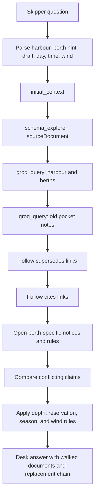
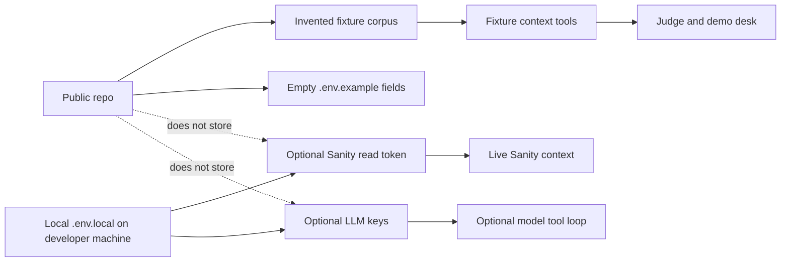

# Design Notes

Sounding is a day-boat briefing desk over invented harbour paperwork. The point is to answer from the standing chain of notices, citations, berth links, and weather rules instead of from the first keyword hit.

## Question Walk

For Marsamxett, the 2019 pocket note is opened because it is the old harbour source. HN-2024-17 is then opened because it supersedes that pocket note. HN-2025-03 is opened because it cites HN-2024-17 and reserves the outer berths. The gregale rule is opened because weather can change which berths count as sheltered.

## Secret Boundary

Fixture mode is the default path and needs no token. The public repo names the Sanity project, dataset, and knowledge base so the setup is understandable, but read tokens and model keys stay out of git.
